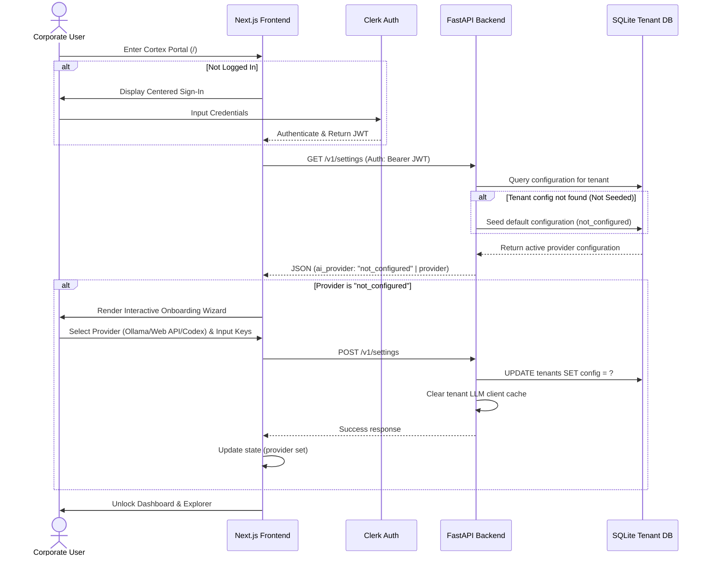

# Cortex OS Onboarding & AI Provider Configuration Documentation

## Overview

To simplify initialization and improve developer experience, Cortex OS introduces an **Onboarding & Authentication Flow** coupled with a **Dynamic AI Provider Settings Page**. 

Prior to these changes, the backend defaulted to starting a Codex App Server upon initial connection. This would fail or hang if the Codex CLI was not installed locally. The system has now been hardened so that:
1. Users must authenticate first.
2. If the active tenant has not configured an AI provider (Ollama, Web API, or Codex), they are intercepted by an **Onboarding Wizard** to select and configure a provider before accessing the dashboard.
3. Users can switch their configurations at any time via a dedicated **Settings Page**.

---

## Authentication & Onboarding Flow

The following Mermaid diagram visualizes the navigation and setup lifecycle:



---

## Backend Infrastructure Details

### 1. Model Seeding and Schema Compatibility
Each tenant's local SQLite database contains a `tenants` metadata table. During connection setup, the backend automatically ensures a configuration record exists for the tenant:
```sql
INSERT OR IGNORE INTO tenants (id, name, created_at, git_repo_path, hnsw_index_path, config)
VALUES (?, ?, ?, ?, ?, ?)
```
This guarantees that foreign key constraints on `query_log` and `ingestion_jobs` never fail when accessing tenant databases.

### 2. LLM Client Dynamic Resolving
The backend resolves `CortexLLMClient` dynamically for each query or ingestion job. The [get_kimi_client](file:///D:/Cortex/phase-2/backend/app/llm/kimi.py) helper reads the tenant's SQLite config, instantiates the client, and caches the object. When a settings update occurs, this cache is cleared to force instant reloading of endpoints and credentials.

### 3. API Endpoints

#### `GET /v1/settings`
Retrieves the tenant's active provider selection and configurations.
* **Response Model**:
  ```json
  {
    "ai_provider": "web_api",
    "config": {
      "ollama_endpoint": "http://localhost:11434/v1",
      "ollama_model": "llama3",
      "web_api_endpoint": "https://api.openai.com/v1",
      "web_api_key": "sk-...",
      "web_api_model": "gpt-4o",
      "codex_endpoint": "ws://127.0.0.1:4500",
      "codex_model": ""
    }
  }
  ```

#### `POST /v1/settings`
Updates the tenant's AI provider configurations and flushes LLM client caches.
* **Request Model**:
  ```json
  {
    "ai_provider": "ollama",
    "config": {
      "ollama_endpoint": "http://127.0.0.1:11434/v1",
      "ollama_model": "llama3"
    }
  }
  ```

---

## Frontend Components

### 1. [MainAppWrapper](file:///D:/Cortex/phase-2/frontend/components/MainAppWrapper.tsx)
A client-side layout interceptor that queries `/v1/settings`. If the returned provider is `"not_configured"`, it renders the interactive setup layout instead of page children.

### 2. [SettingsPage](file:///D:/Cortex/phase-2/frontend/app/settings/page.tsx)
Accessible from the sidebar menu, this page permits real-time switching of model backends and endpoint parameters with instant caching.

---

## Supported Providers & Setup Guide

### Option 1: Web API
Connects to cloud providers matching the OpenAI-compatible standard (e.g. OpenAI, Groq, Azure OpenAI).
* **Endpoint URL**: The base URL (e.g., `https://api.groq.com/openai/v1` or `https://api.openai.com/v1`).
* **API Key**: Secure auth token.
* **Model Name**: The exact cloud model ID (e.g., `llama-3.1-8b-instant` or `gpt-4o`).

### Option 2: Ollama (Local)
Spawns and queries a local model hosted via Ollama.
* **Ollama Endpoint**: Defaults to `http://localhost:11434/v1`.
* **Model Name**: The local tag name (e.g., `llama3` or `mistral`).
* *Note: The backend checks if the model is installed on startup and automatically triggers `ollama pull <model>` if it is missing.*

### Option 3: Codex CLI
Connects to an active Codex WebSocket app-server.
* **Codex Endpoint**: WebSocket URL (e.g., `ws://127.0.0.1:4500`).
* **Model**: Optional custom model selection override.
