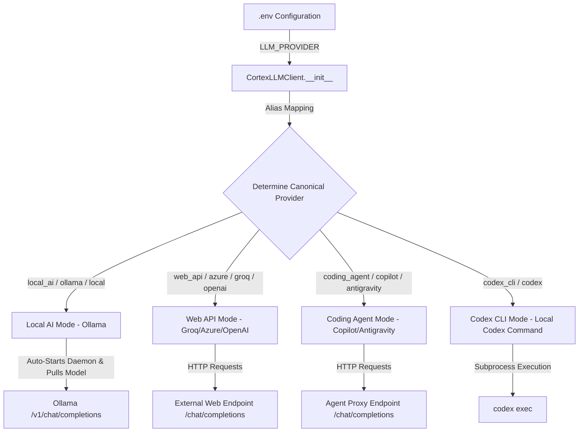

# AI LLM Provider Configuration — Architecture & Integration Guide

## Overview

The Cortex Knowledge OS is designed to be highly flexible and environment-agnostic. To accommodate different developer workflows, compute capabilities, and API preferences, the system features a unified LLM interface (`CortexLLMClient`, also aliased as `KimiClient`) that abstracts away communication with various Large Language Models (LLMs).

Users can seamlessly toggle between **Local LLMs** (run fully offline via Ollama), **Commercial Web APIs** (e.g., Groq, Azure, OpenAI), and **Coding Agent/Copilot Endpoints** (e.g., GitHub Copilot, Codex, Antigravity) simply by updating their environment configuration (`.env`).

---

## Architecture of LLM Selection

The LLM abstraction is defined in [kimi.py](file:///d:/Cortex/phase-1/app/llm/kimi.py) under the class `CortexLLMClient`. 

When the client is initialized via `get_kimi_client()` (or its alias `get_cortex_client()`), it inspects the `LLM_PROVIDER` environment variable and instantiates the client under one of the three canonical provider modes.



### Provider Alias Resolution

To prevent configuration errors and allow user flexibility, the client maps various provider nicknames to one of the three canonical providers using `_PROVIDER_MAP`:

| User Value | Canonical Provider Mode | Primary Target Use Case |
| :--- | :--- | :--- |
| `local_ai`, `ollama`, `local` | **`local_ai`** | Fully local/offline execution (Ollama) |
| `web_api`, `azure`, `web`, `openai`, `groq` | **`web_api`** | Standard cloud APIs (Groq, OpenAI, Azure OpenAI) |
| `coding_agent`, `copilot`, `antigravity`, `agent` | **`coding_agent`** | Developer copilot API endpoints and custom coding agents |
| `codex_cli`, `codex` | **`codex_cli`** | Local OpenAI Codex CLI execution (`codex exec`) |

---

## Detailed Provider Specifications

### 1. Local AI Mode (`local_ai`)
Designed for privacy-first, offline, or zero-cost execution on developer hardware.
* **Backend Tool**: Ollama (must be installed on the system).
* **Auto-Start Capability**: If the client detects that Ollama is not running on the designated endpoint, it will attempt to launch the background daemon (`ollama serve`) automatically.
* **Auto-Model Pull**: Before sending completions, the client checks if the target model is downloaded locally. If not, it runs `ollama pull <model>` in a subprocess to automatically download it.
* **Timeout adjustments**: Request timeout is extended to **300 seconds** to prevent timeouts during the first cold run when loading model weights to system memory/VRAM.

**Environment Variables Required:**
```env
LLM_PROVIDER=local_ai
OLLAMA_ENDPOINT=http://127.0.0.1:11434/v1
OLLAMA_MODEL=gemma:2b
```

---

### 2. Web API Mode (`web_api`)
Ideal for high-throughput, low-latency, and high-intelligence reasoning via commercial API providers.
* **Compatibility**: Supports any OpenAI-compatible completions endpoint.
* **Backwards Compatibility**: Automatically falls back to legacy Azure OpenAI environment variables if specified (`AZURE_ENDPOINT`, `AZURE_API_KEY`, `AZURE_MODEL_NAME`).

**Environment Variables Required (e.g. Groq/OpenAI):**
```env
LLM_PROVIDER=web_api
WEB_API_ENDPOINT=https://api.groq.com/openai/v1
WEB_API_KEY=gsk_your_groq_api_key_goes_here
WEB_API_MODEL=llama-3.1-8b-instant
```

---

### 3. Coding Agent Mode (`coding_agent`)
Optimized for developer agents using specialized coding models (like Codex, Copilot CLI, or Antigravity proxy models) that expose autocomplete or chat completions.

**Environment Variables Required:**
```env
LLM_PROVIDER=coding_agent
AGENT_ENDPOINT=https://api.githubcopilot.com
AGENT_API_KEY=gho_YOUR_GITHUB_COPILOT_TOKEN_HERE
AGENT_MODEL=gpt-4o
```
> [!NOTE]
> Codex and Copilot APIs typically require a token to be configured. The client routes requests through the designated `AGENT_ENDPOINT` using `AGENT_API_KEY` as a bearer token.

---

### 4. Codex CLI Mode (`codex_cli`)
Allows using the local OpenAI Codex command line interface (`codex exec`) directly as a text completion engine.
* **Mechanism**: Runs the `codex` command as a subprocess using python's `subprocess.run` with `stdin=subprocess.DEVNULL` to run non-interactively.
* **Output Capture**: Passes `-o <temp_file>` to write the final response cleanly, avoiding TUI or stdout contamination.
* **Configuration**: Runs in `--ephemeral` mode with `--ignore-rules` and `--ask-for-approval never` to guarantee zero-cost and prompt execution.

**Environment Variables Required:**
```env
LLM_PROVIDER=codex_cli
AGENT_MODEL=gpt-4o  # Optional: specific model for Codex CLI (e.g. gpt-4o, o3, etc.)
```

---

## Resilience & Rate Limiting

Cortex includes built-in resilience measures when making requests to all AI providers, particularly important for cloud APIs:
1. **Exponential Backoff**: If a request fails due to transient network issues, the client retries up to 5 times, doubling the wait time after each retry (`2s, 4s, 8s, 16s...`).
2. **Rate Limit Recovery (HTTP 429)**: 
   - First parses the `retry-after` header from the response.
   - If not present, parses the JSON error body to match rate-limit message strings (e.g., `"try again in 1m23.4s"`).
   - Pauses execution dynamically for the exact duration before retrying, ensuring ingestion runs don't fail due to token limits.
3. **OpenAI Compatibility**: All requests are unified under the standard chat completions payload format, transforming custom inputs to structured OpenAI payloads.

---

## Troubleshooting

### Local Ollama fails to respond
* Verify Ollama is installed on your system and added to your `PATH`.
* Try running `ollama list` in your terminal to see if the CLI responds.
* If you encounter DNS resolution delays on Windows, change your endpoint from `http://localhost:11434/v1` to `http://127.0.0.1:11434/v1`.

### Authentication Failures
* Ensure that the `Bearer` token in the authorization headers corresponds to the correct endpoint.
* For GitHub Copilot, verify that the `gho_` token has the proper scopes and permission to execute Copilot requests.
