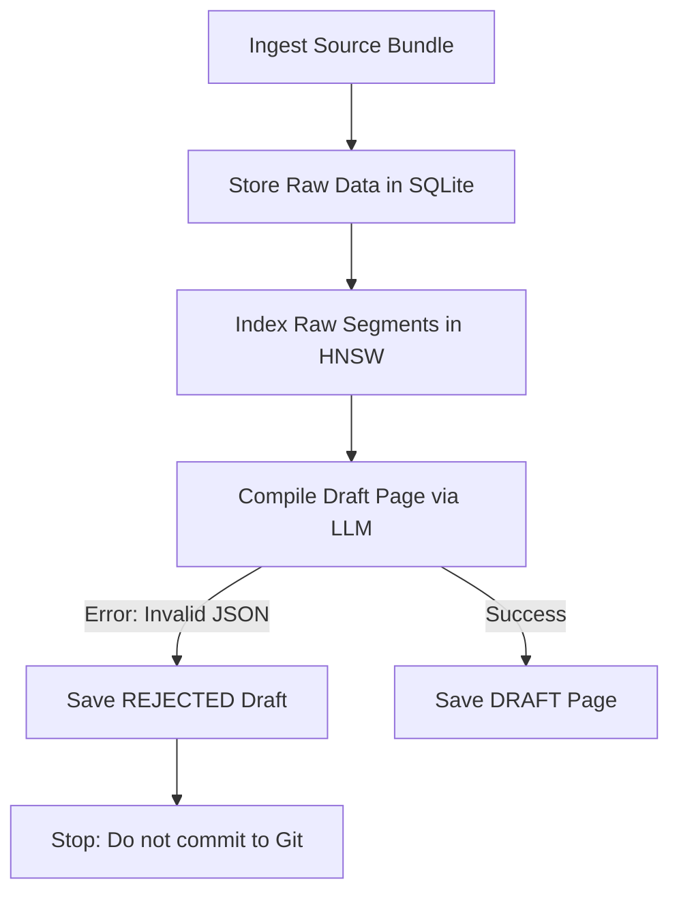

# Ingestion Pipeline Failure Report (July 1, 2026)

This report details the failure that occurred during the ingestion of the **Flowgent — Technical Architecture Paper** document today.

---

## 📋 Job Metadata

| Field | Value |
| :--- | :--- |
| **Sync Run ID** | `job_upload_edabf704` |
| **Tenant ID** | `user_3FFu8d2bNoY8nkiJe2kdIQc6pFZ` |
| **Source Connector** | `local_upload` |
| **Upload Time** | `2026-07-01T03:19:15.849910Z` (Universal Time) / `08:49:15 AM` (Local Time) |
| **Source File Name** | `Flowgent — Technical Architecture Paper 31ecd91ab20380e8bb00da8d72db5ce4.md` |
| **Status** | `failed` ❌ |
| **Error Message** | `LLM compilation failed: Expecting value: line 1 column 1 (char 0)` |

---

## 🔍 Ingestion Pipeline Flow Analysis

The Cortex ingestion pipeline consists of three sequential phases:

### 1. Raw Storage Stage: **SUCCESS**
* **Document ID**: `srcdoc_46632d4bf34e4de9bf3f075500dbd3d9`
* **Segments Ingested**: **159 paragraphs/headings** successfully written to the `source_segments` table.
* **Outcome**: The raw text content is fully persisted in the SQL metadata store and remains associated with the tenant.

### 2. Vector Indexing Stage: **SUCCESS**
* **Action**: All 159 segments were processed by FastEmbed and added to the HNSW vector index.
* **Outcome**: These segments are fully searchable via semantic/hybrid queries right now.

### 3. LLM Compilation Stage: **FAILED** ❌
* **Action**: `DraftCompiler.compile_draft` formatted the 159 segments and queried the LLM client (Ollama/Web API) to synthesize the draft.
* **Failure Reason**: The LLM returned an empty response, an HTTP error, or non-JSON text. The compiler's JSON parser threw a `JSONDecodeError: Expecting value: line 1 column 1 (char 0)` when trying to parse the output.
* **Outcome**: A draft `draft_200b8f8b248045a48aee79a8dba9ec2a` was created with `status = 'REJECTED'` and `validation_passed = 0`. No git commit was initiated.

---

## 🛠️ Diagnosis & Recommendations

> [!WARNING]
> The error indicates a communication or parsing breakdown between the backend and the configured LLM API.

1. **Verify LLM Settings**:
   * Verify that the active LLM provider (e.g. Ollama `llama3.2:3b`) is fully started and responsive to chat completions.
   * If using a local model, verify that it has sufficient context length settings to handle the 159 segments sent in the prompt.
2. **Context Window Limitations**:
   * With 159 segments, the prompt size might have exceeded the model's max tokens, causing the API to return a truncated response or a `400 Bad Request` HTML error instead of valid JSON.
   * **Recommendation**: Add segmentation chunking to the compiler or reduce the number of segments sent to the LLM during the initial synthesis.
3. **Retry Mechanism**:
   * Add automated retry/exponential backoff to the LLM chat completion request in `app/llm/kimi.py` specifically for `429` (Rate Limited) or transient errors.
