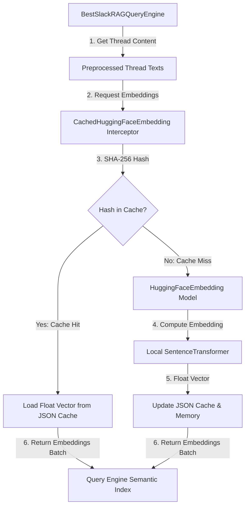

# Smart Incremental Cache — Technical Architecture Document

## Overview

The **Smart Incremental Cache** is an optimization layer implemented within the Cortex RAG system's embedding engine. In our RAG system, documents are constructed by grouping Slack messages into conversation threads. Generating semantic embeddings for these threads using local Hugging Face transformer models (such as `BAAI/bge-small-en-v1.5`) is extremely CPU-intensive and slow, requiring minutes to process over a thousand documents on standard environments.

To achieve **sub-second startup times**, the Smart Incremental Cache interceptor intercepts embedding generation requests, hashes each conversation thread, and retrieves cached embeddings for unchanged threads, computing embeddings only for new or modified threads.

---

## Architecture

The caching system is designed around a **Dictionary-Keyed Incremental Cache** stored as a JSON file (`doc_embeddings_cache.json`). It operates at the batch embedding retrieval layer.

### Core Architecture Components



### Detailed Flow
1. **Hashing**: Each document thread is represented as a cleaned, PII-redacted, and user-mapped text block. A SHA-256 hash is computed for this exact string content.
2. **Lookup**: The cache dictionary is queried using the hex digest of the SHA-256 hash.
3. **Retrieval**:
   - If the hash is present, the corresponding floating-point vector (embedding) is directly loaded from memory/JSON.
   - If the hash is missing (either due to a new thread or a thread that was modified by edits/new replies), it is marked as a **Cache Miss**.
4. **Incremental Computation**: The baseline `get_text_embedding_batch` method is invoked *only* for the subset of missing documents.
5. **Persistence**: The newly computed embeddings are appended to the cache dictionary, which is then persisted back to `data/doc_embeddings_cache.json`.

---

## Technical Specifications

### Key/Value Schema
- **Key**: Hexadecimal SHA-256 digest of the raw thread content (64 characters).
- **Value**: A list of 384 floating-point numbers representing the dense vector representation.

Example entry:
```json
{
  "c8f4a13b6d274534e79b8a07cde92a43b9df7a12b7aef893a207bcde81a0293d": [
    0.012356, -0.045612, 0.089123, ...
  ]
}
```

### Key Design Benefits
1. **Sub-second Initialization**: Startup times drop from ~2-5 minutes to under **0.1 seconds** on subsequent runs when no threads have changed.
2. **Incremental Updates**: If a thread gets a new reply, its text changes, yielding a new hash. The system automatically recalculates the embedding for *only* that thread, preserving the cache for all other threads.
3. **Storage Efficiency**: A cache for ~1,170 threads consumes approximately **10MB** of disk space, making storage bloat negligible.
4. **Collision Resistance**: SHA-256 has a virtually zero probability of collision, ensuring that distinct thread texts never mistakenly share the same cached embedding.

---

## Operations & Usage Guide

### Cache Directory Location
The cache is stored in:
- Default: `phase-1/data/doc_embeddings_cache.json`
- Configurable via the environment variable `DOC_EMBEDDINGS_CACHE_PATH`.

### Clearing / Invalidating the Cache
To completely rebuild all embeddings:
1. Delete the `doc_embeddings_cache.json` file from the disk.
2. Re-run the RAG pipeline or query engine. It will automatically detect the missing file, compute all embeddings, and generate a fresh cache.

### Verification and Logging
When initialization occurs, the system outputs logging telemetry:
- **Cache Hit (Full)**:
  `[CACHE] All 1174 document embeddings successfully loaded from cache.`
- **Cache Miss (Partial)**:
  `[CACHE] Cache miss: computing embeddings for 5 / 1174 documents...`
  `[CACHE] Updating cache file...`
