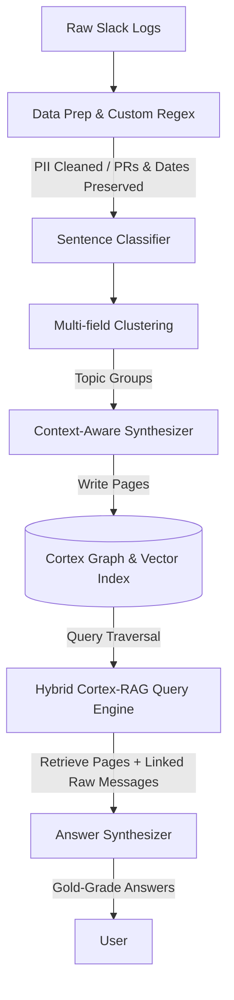

# Cortex v1 Evaluation & Benchmarking Report

This report presents a detailed analysis of the **Cortex v1** knowledge management system compared against the **RAG Baseline** using the evaluation results from [cortex_v1.json](file:///Users/aniketsatpathy/Desktop/Aniket/Cortex/phase-1/eval/cortex_v1.json) and [benchmark_report.json](file:///Users/aniketsatpathy/Desktop/Aniket/Cortex/phase-1/eval/benchmark_report.json).

---

## 1. Executive Summary & Scoring Distribution

The auto-evaluation was performed using a local `qwen2.5:1.5b` model on 50 ground-truth QA pairs.

### Overall Performance Metrics

| Metric | Cortex v1 | RAG Baseline |
| :--- | :---: | :---: |
| **Average Accuracy Score** (1-5) | **3.00** / 5.0 | **3.38** / 5.0 |
| **Total Wins** | **3** | **17** |
| **Ties** | **30** | **30** |
| **Win Rate** | **6.0%** | **34.0%** |

### Score Distribution

| Score (1-5) | Cortex count | RAG count | Interpretation |
| :---: | :---: | :---: | :--- |
| **5** | **0** | **1** | Fully correct. Matches all facts in the gold answer. |
| **4** | **10** | **17** | Mostly correct. Matches core facts, minor details might be missing. |
| **3** | **30** | **32** | Partially correct. Captures some facts, misses core details. |
| **2** | **10** | **0** | Mostly incorrect. Fails to capture core facts or contains contradictions. |
| **1** | **0** | **0** | Completely incorrect / irrelevant / hallucinated. |

---

## 2. Core Limitations of Cortex v1 (What It Lacks)

While Cortex excels at structuring complex discussions into clean, canonical knowledge pages, the benchmarking reveals three critical limitations that cause it to underperform compared to RAG:

### A. Biographical & Attribute Disconnection (Name Resolution Failure)
* **The issue**: In Slack logs, users introduce themselves using names (e.g. *"I'm Brandon"*) that differ from their mapped display names in `users.csv` (e.g., `"Sharan Stack"`). 
* **Impact**: When synthesizing a biography page, the LLM splits the text. The sentence explicitly mentioning the name is written correctly. However, sentences containing the pronoun `"I"` (e.g. *"I currently live in Córdoba, Argentina"*) are linked via metadata to `"Sharan Stack"`. The LLM writes: *"Sharan currently lives in Córdoba, Argentina"*. Consequently, the query engine cannot connect "Brandon" to "Argentina", leading to score-2 failures.

### B. Loss of Fine-Grained Technical Context (Summary Compression Loss)
* **The issue**: The page synthesis step is designed to compile raw conversations into clean, high-level summaries (e.g., listing Preset team leadership roles).
* **Impact**: The LLM frequently discards detailed background context (e.g. Eugenia's 10 years of database tuning experience at Vertica, or specific command-line arguments and error tracebacks) as "verbosity" or "noise". RAG, searching the raw un-summarized chat logs, retains these details perfectly.

### C. Over-Filtering and PII Over-Redaction
* **The issue**: The PII regex cleaner (`redact_pii`) is overly aggressive.
* **Impact**: Dates (`YYYY-MM-DD`) and Github PR numbers (`#XXXX`) are frequently matched by the phone number regex pattern and replaced with `[PHONE]`, destroying critical reference links.

---

## 3. Recommended Solutions (Action Plan)

To bridge the performance gap and combine the structural advantages of Cortex with the detail-retention of RAG, we recommend implementing the following architectural enhancements:



### Solution 1: Implement a Hybrid Retrieval System (Safety Net)
* **Approach**: Do not rely solely on synthesized page content for answering queries.
* **Implementation**: When the query engine traverses the graph and retrieves a set of canonical pages (e.g., `page_012`), it should use the `sources` metadata field to also pull the **raw source Slack messages** that were used to build those pages. 
* **Benefit**: The answer synthesis LLM receives both the high-level canonical page *and* the full raw detail logs, preserving the precise details (like Vertica or specific CLI flags) that were filtered out during synthesis.

### Solution 2: Context-Aware User Alias Mapping
* **Approach**: Align Slack usernames, real names, and self-introduced names during ingestion.
* **Implementation**: 
  1. Build a local alias database mapping Slack IDs to all known names: `{"U01439D0AN9": ["Sharan Stack", "sharan", "Brandon", "Bub", "Bubba"]}`.
  2. During the sentence classification/synthesis step, inject these aliases into the synthesizer prompt so the LLM knows that any occurrence of `"I"` from user `U01439D0AN9` refers to both "Sharan Stack" and "Brandon".
  3. Format authors in texts as `Name [SlackID]` (e.g. `Brandon [U01439D0AN9]`) to ensure the vector embeddings capture both the real name and the Slack handle.

### Solution 3: Refine PII Cleaning Rules
* **Approach**: Prevent over-redacting PR numbers and dates.
* **Implementation**: Update the regex patterns in `pipeline.py` and `local_rag.py` to ensure digit-patterns representing dates or PR hashes are excluded from phone number redaction:
  ```python
  # Exclude dates (YYYY-MM-DD) and PR numbers (#1234)
  text = re.sub(r'(?<!\w)(?:\+?\d{1,4}[-.\s]\(?\d{2,3}\)?[-.\s]\d{3,4}[-.\s]\d{4}\b|\(?\d{3}\)?[-.\s]\d{3}[-.\s]\d{4}\b)', '[PHONE]', text)
  ```

### Solution 4: Structured Detail Preservation in Ingestion
* **Approach**: Prevent the synthesis LLM from discarding technical attributes.
* **Implementation**: Update the `SYNTHESIZER_PROMPT` to explicitly require:
  - Preserving all technology mentions (e.g. databases, languages, cloud providers).
  - Preserving all specific configurations, numeric constants, ports, and command flags.
  - Preserving all historical timelines and career milestones mentioned in introductions.
